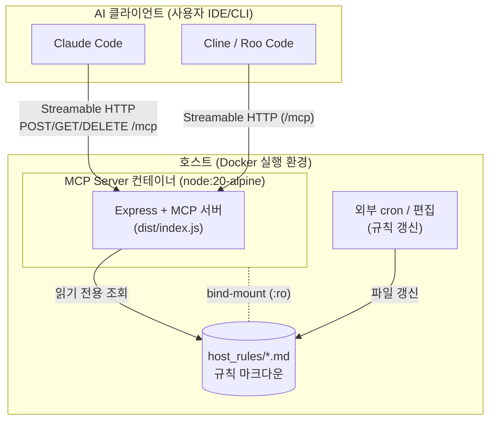
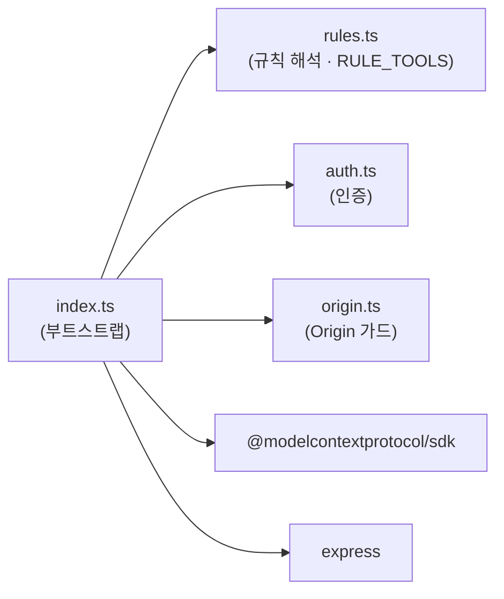
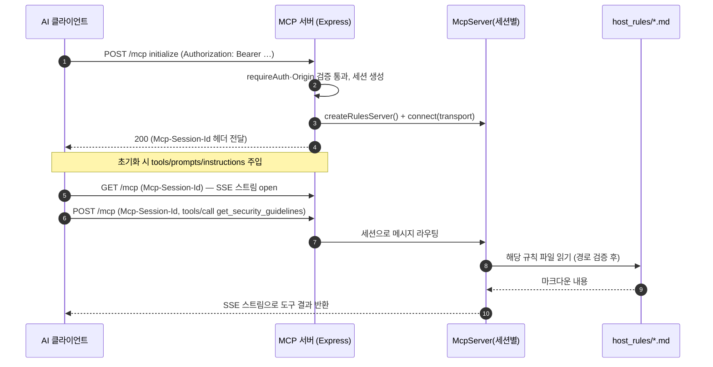
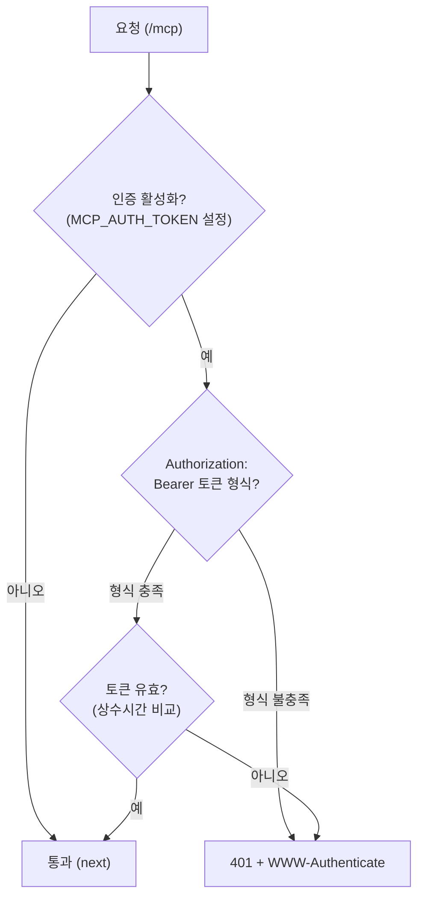

# Personal Rules MCP Server — 아키텍처 및 시스템 구성

> 이 문서는 저장소의 구조·동작·운영을 맥락 없는 협업자도 이해할 수 있도록 정리한 기술 문서입니다.
> 사용자 관점의 빠른 시작은 [README.md](../README.md) / [README.ko.md](../README.ko.md) 를,
> 커밋/PR·문서·다이어그램 규약은 서버가 제공하는 규칙 문서를 참고하십시오.
>
> **상태**: Active · **대상 독자**: 서버를 운영·확장·리뷰하는 개발자

---

## 1. 개요

### 1.1 목적
Personal Rules MCP Server 는 **내 개인 엔지니어링 규칙·선호**(코딩 표준, 워크플로우,
커밋 규약, 완료 기준, 보안, 코드 리뷰, 문서·다이어그램 표준, 브랜치 전략,
테스트 표준, API 설계, 의존성 관리, 로깅/관측성, 설정·환경 관리, 데이터·영속성,
에러 처리·복원력, 성능, AI 보조 코딩, 국제화·현지화, 동시성·비동기, 접근성, CI/CD)을
[MCP(Model Context Protocol)](https://modelcontextprotocol.io) 로 AI 클라이언트
(**Claude Code CLI/Web · Cline · Roo Code** 등)에 제공하는 서버입니다.
제공하는 도구·프롬프트의 용도별 안내는 [docs/tools-and-prompts.ko.md](tools-and-prompts.ko.md) 를 참고하십시오.

### 1.2 해결하려는 문제
규칙 문서가 각 저장소·위키·개인 노트에 흩어져 있으면 다음 문제가 발생합니다.

- 규칙이 갱신돼도 각 사본이 동기화되지 않아 **drift(불일치)** 가 쌓입니다.
- 프로젝트마다 서로 다른 규칙을 적용해 **결과물이 중구난방**이 됩니다.
- AI 어시스턴트가 내 표준을 알 방법이 없어 **일반론적 산출물**을 냅니다.

이 서버는 규칙을 **한 곳(single source of truth)** 에서 관리하고, AI 가 작업 시점에
**필요한 규칙을 자동으로 조회**하도록 만들어 내 모든 프로젝트 산출물의 품질을 균일하게 끌어올립니다.

### 1.3 범위 (Scope / Non-scope)
- **In scope**: 내 모든 프로젝트에 공통으로 적용되고 한 곳에서 갱신해야 하는 **프로젝트 무관(project-agnostic) 규칙**.
- **Out of scope**: 프로젝트마다 다른 **빌드/테스트/검증 명령**과 **프로젝트 고유 아키텍처**. 이들은 각 저장소의 `CLAUDE.md` / `AGENTS.md` 가 보유합니다([2. 하이브리드 모델](#2-설계-원칙-하이브리드-모델) 참조).

---

## 2. 설계 원칙: 하이브리드 모델

이 서버의 가장 중요한 설계 결정은 규칙을 **두 계층으로 분리**한 것입니다.

| 계층 | 담는 내용 | 위치 | 갱신 주체 |
|---|---|---|---|
| **개인 공통 · 크로스 프로젝트** | 코딩 표준, 워크플로우, 커밋, 보안, 코드리뷰, 완료 기준, 문서·다이어그램, 브랜치 전략, 테스트·API 설계·의존성·로깅, 설정·데이터·에러 처리·성능·동시성, AI 보조 코딩, 국제화·접근성, CI/CD | **이 MCP 서버** (`host_rules/`) | 나(규칙 오너) |
| **프로젝트별** | 빌드/테스트/검증 **명령**, 타깃, 프로젝트 아키텍처 | 각 저장소 `CLAUDE.md` / `AGENTS.md` ([repo-templates/](../repo-templates/)) | 나(프로젝트별) |

**근거**: 프로젝트 유형(WebApp, Chromium fork, Vehicle Framework 등)마다 빌드 체계가 전혀
다르므로 이를 중앙 서버에 넣으면 프로젝트 종속성이 서버로 새어 들어옵니다. 반대로 "커밋은
이렇게 쓴다", "보안은 이 기준을 지킨다" 같은 규칙은 내 모든 프로젝트가 동일하게 지켜야 하므로
중앙화가 옳습니다. 이 경계를 지키는 것이 이 시스템의 핵심 규율입니다.

> **도구 사용 안내의 단일 소스도 서버입니다.** "AI 가 어떤 도구를 언제 부르는가"에 대한
> 안내는 서버의 도구 설명과 `instructions` 에만 두고 저장소 파일에 중복하지 않습니다.
> 중복하면 서버 변경과 어긋나기 때문입니다([7. AI 연동](#7-ai-연동-도구를-언제-부르는가) 참조).

---

## 3. 시스템 구성 (C4 — Container 레벨)

아래는 시스템을 컨테이너 단위로 본 구조입니다. 화살표는 **런타임 요청/데이터 흐름**을 뜻합니다.



**핵심 포인트**
- 규칙 마크다운은 **이미지에 굽지 않고** 호스트 디렉터리를 컨테이너에 **읽기 전용 bind-mount** 합니다. 따라서 규칙만 바뀌면 **재빌드·재기동 없이** 즉시 반영됩니다.
- 각 클라이언트 연결은 **독립된 세션**입니다([6. 요청 흐름](#6-요청-흐름) 참조).
- 프로젝트별 `CLAUDE.md` 는 이 컨테이너와 무관하게 각 저장소에 있으므로 위 그림에 포함되지 않습니다(하이브리드 모델).

---

## 4. 컴포넌트 (Component 레벨)

서버 소스는 **테스트 용이성**을 위해 순수 로직과 부트스트랩을 분리했습니다.

| 파일 | 책임 | 특징 |
|---|---|---|
| [src/index.ts](../src/index.ts) | Express·MCP 부트스트랩. 도구/프롬프트 등록, 엔드포인트 라우팅, 인증 연결, 기동/셧다운 | 프로세스 진입점 |
| [src/rules.ts](../src/rules.ts) | 규칙 파일 해석·읽기. 파라미터 없는 규칙 도구의 단일 소스(`RULE_TOOLS`), 언어 목록(`CODING_LANGUAGES`), 경로 traversal 방어(`resolveWithinRules`), 구조화된 결과(`ReadResult`) 반환 | 순수 함수, `root` 를 인자로 받아 단위 테스트 가능 |
| [src/auth.ts](../src/auth.ts) | Bearer 토큰 파싱, 상수시간 검증(`makeTokenValidator`), 인증 미들웨어(`makeRequireAuth`) | HTTP 계층 없이 테스트 가능 |
| [src/origin.ts](../src/origin.ts) | Origin 허용/거부 판정과 가드 미들웨어(`makeOriginGuard`), 목록 파싱(`parseList`) — DNS-rebinding 방어 | 순수 헬퍼, HTTP 계층 없이 테스트 가능 |
| [src/rules.test.ts](../src/rules.test.ts), [src/auth.test.ts](../src/auth.test.ts), [src/origin.test.ts](../src/origin.test.ts), [src/rules-integrity.test.ts](../src/rules-integrity.test.ts) | `node:test` 단위 테스트 | 경로 방어·인증 판정·Origin 판정 검증. `rules-integrity` 는 `RULE_TOOLS` 를 실제 파일·`<file>.md → get_<name>` 매핑과 대조 |



> 화살표는 **모듈 의존(import)** 방향입니다. `rules.ts` / `auth.ts` / `origin.ts` 는 `index.ts` 에
> 의존하지 않으므로 서버를 기동하지 않고도 독립적으로 테스트됩니다.

---

## 5. 전송 방식 (Transport)

- 전송은 현행 MCP 표준인 **Streamable HTTP** 입니다(stdio 아님). 단일 엔드포인트 `/mcp` 로 다수 클라이언트가 접속할 수 있습니다.
- 세션마다 `McpServer` 인스턴스와 `StreamableHTTPServerTransport` 를 **1:1 로 새로 생성**해 세션을 격리합니다.
- 세션 식별자는 `Mcp-Session-Id` **응답 헤더**로 클라이언트에 전달되며, 이후 요청은 같은 헤더를 **요청 헤더**로 실어 해당 세션으로 라우팅됩니다. `initialize` 핸드셰이크도 `POST /mcp` 로 수행됩니다.
- 서버→클라이언트 스트리밍은 내부적으로 SSE 를 사용하지만, 이는 `GET /mcp` 안에서 열리는 스트림일 뿐 별도의 `/sse` 엔드포인트는 없습니다.

> **설계 메모**: 과거 HTTP+SSE 전송(`GET /sse` + `POST /messages`)은 최신 MCP 스펙에서
> Streamable HTTP 로 대체되어 이 서버에서 **제거**되었습니다. TLS/리버스 프록시 노출 방안은
> [docs/reverse-proxy-tls.md](reverse-proxy-tls.md) 결정 기록을 참고하십시오.

### HTTP 엔드포인트
| 메서드 | 경로 | 인증 | 용도 |
|---|---|---|---|
| `POST` | `/mcp` | 필요(활성 시) | 클라이언트 → 서버 JSON-RPC(및 `initialize` 핸드셰이크) |
| `GET` | `/mcp` | 필요(활성 시) | 서버 → 클라이언트 SSE 스트림 열기(세션 단위) |
| `DELETE` | `/mcp` | 필요(활성 시) | 세션 종료 |
| `GET` | `/health` | **항상 개방** | 헬스 체크(버전·rulesDir·authEnabled·activeSessions·uptime 반환) |

---

## 6. 요청 흐름

### 6.1 연결 및 도구 호출 (정상 경로)



### 6.2 인증 판정 (`makeRequireAuth`)



> `/health` 는 이 흐름을 거치지 않고 항상 개방됩니다(컨테이너 헬스체크용).

---

## 7. AI 연동: 도구를 언제 부르는가

AI 가 규칙을 **자율적으로** 조회하도록 세 경로로 안내합니다. 안내의 **단일 소스는 서버**이며
저장소 파일에 중복하지 않습니다.

1. **도구 설명(description)**: 연결 시 모든 도구의 이름·설명·스키마가 AI 컨텍스트에 **항상** 주입됩니다. 각 설명에 "언제 호출하라"가 담겨 있습니다.
2. **서버 instructions**: 초기화 때 전역 사용 지침을 제공합니다. 여기에는 **상호 참조 해석 규칙**도 포함됩니다 — 규칙 문서가 다른 파일(예: `security-guidelines.md`)을 언급하면, 파일명에 대응하는 `get_<name>` 도구로 가져오도록 안내합니다.
3. **레포 `CLAUDE.md` / `AGENTS.md`**: **프로젝트 고유** 내용(빌드/테스트/검증 명령, 아키텍처)만 담고, 공통 도구 목록은 넣지 않습니다.

### 제공 도구 (Tools)

**전체 도구 목록과 각 도구의 용도·호출 시점**은 한 곳에만 둡니다 —
👉 **[docs/tools-and-prompts.ko.md](tools-and-prompts.ko.md)**

여기(아키텍처 문서)에 목록을 복제하지 않는 이유는, 규칙이 추가될 때마다 동기화해야 할
지점이 늘어나 조용히 어긋나기 때문입니다. 이 문서는 **목록이 아니라 구조**를 설명합니다.

- **등록 원천**: 파라미터 없는 도구는 전부 `src/rules.ts` 의 `RULE_TOOLS` 매니페스트에서
  자동 등록됩니다. `get_coding_standards` 만 `language` 파라미터를 받는 예외로
  `src/index.ts` 에 직접 등록됩니다(§14 참조).
- **설명·instructions 생성**: 각 항목의 `whenToCall` 하나가 도구 설명("… Call this …")과
  서버 `instructions` 의 트리거 줄을 **모두 생성**합니다(`toolDescription()` /
  `instructionLine()`). 그래서 둘은 구조적으로 어긋날 수 없습니다.
- **문서 동기화**: `rules-integrity.test.ts` 가 모든 도구·언어가 README·안내 문서에
  등장하는지 검사하므로, 누락은 테스트 실패로 드러납니다.

### 제공 프롬프트 (Prompts) — 2개
| 프롬프트 | 인자 | 동작 |
|---|---|---|
| `code-review` | `target`(선택) | `code-review-guidelines.md` 로드 후 diff 리뷰 |
| `commit-msg` | `issue_key`(선택) | `commit-guidelines.md` 로드 후 커밋 메시지 초안 |

> **파일명 → 도구 매핑 규칙**: 모든 규칙 파일은 예외 없이 `파일명.md → get_<name>` 으로 매핑됩니다
> (예: `security-guidelines.md → get_security_guidelines`). 이 규칙 덕분에 AI 는 문서 간 상호 참조를
> 결정론적으로 따라갈 수 있습니다.

---

## 8. 규칙 콘텐츠 구성

규칙은 `RULES_DIR`(기본 `/app/rules`, 호스트 `./host_rules` 마운트)에서 읽습니다.

```
host_rules/
├── <규칙>.md            # 최상위 규칙 파일 하나 = 파라미터 없는 도구 하나
│                        #   (파일명 → get_<name>, 하이픈은 언더스코어로)
└── coding-standards/
    └── <언어>.md        # get_coding_standards { language: "<언어>" }
```

> **실제 파일 목록은 여기에 복제하지 않습니다** — 전체 목록과 각 규칙의 용도는
> [docs/tools-and-prompts.ko.md](tools-and-prompts.ko.md) 와 [README](../README.md) 에 있고,
> 디렉터리 자체(`host_rules/`)가 언제나 최신 원본입니다.

- 규칙 문서는 **도구에 무관한 순수 마크다운 콘텐츠**로 유지합니다(레포/위키 어디서든 읽힘). 도구 매핑은 콘텐츠가 아니라 서버 `instructions` 가 담당합니다.
- 문서 간 상호 참조는 **파일명 기반**(예: ``` `commit-guidelines.md` ```)으로 두어 이식성을 지키고, 해석은 서버가 안내합니다.

---

## 9. 보안

| 영역 | 조치 | 위치 |
|---|---|---|
| **인증** | 선택적 정적 Bearer 토큰(`/mcp` 가드). 콤마로 다중 토큰(발급·회전). 미설정 시 개방 + 기동 경고 로그. `401` 응답의 `WWW-Authenticate` realm 은 `personal-rules-mcp` | [src/auth.ts](../src/auth.ts) |
| **DNS-rebinding 방어** | 요청의 `Origin` 헤더를 Express 미들웨어에서 검증. loopback origin 과 Origin 없는 네이티브 클라이언트는 항상 허용하고, 추가 브라우저 origin 은 `MCP_ALLOWED_ORIGINS` 로 허용 목록에 등록. 불일치는 `403` | [src/origin.ts](../src/origin.ts) |
| **상수시간 비교** | 토큰을 SHA-256(고정 32바이트)으로 다이제스트 후 `timingSafeEqual`, 조기 반환 없음(타이밍 누출 방지) | `makeTokenValidator` |
| **경로 traversal 방어** | `resolveWithinRules` 가 `..`·절대경로·sibling-prefix(`<root>-evil`) 탈출을 차단. 입력은 enum/고정 세그먼트로 제약(공격자 제어 세그먼트 없음) | [src/rules.ts](../src/rules.ts) |
| **비-크래시 오류 처리** | 파일 부재·IO 오류는 예외 대신 정중한 메시지로 변환. `/mcp` 핸들러는 try/catch + 전역 `unhandledRejection`/`uncaughtException` 백스톱 | [src/index.ts](../src/index.ts) |
| **최소 권한 런타임** | 컨테이너는 non-root(`node`) 사용자로 실행, 규칙 마운트는 읽기 전용(`:ro`) | [Dockerfile](../Dockerfile) |

> 참고: `resolveWithinRules` 의 방어는 **lexical(문자열 정규화)** 이며 심링크를 해석하지 않습니다.
> 현재는 입력이 제약돼 실위험이 없으나, 향후 사용자 제어 경로가 유입되면 `realpath` 기반 검증을
> 추가해야 합니다.

---

## 10. 배포 · 런타임

### 10.1 Docker (권장)
- **멀티스테이지 빌드**: build 스테이지에서 `npm ci` + `tsc`, runtime 스테이지는 `npm ci --omit=dev` + 컴파일 산출물만 복사([Dockerfile](../Dockerfile)).
- **규칙 미포함**: 이미지에 `host_rules` 를 넣지 않고 런타임에 bind-mount([docker-compose.yml](../docker-compose.yml)).
- **HEALTHCHECK**: `/health` 를 호출하는 헬스체크를 **Dockerfile 에 단일 정의**하고 compose 가 상속합니다.
- **PORT 의미**: compose 의 `PORT` 는 **호스트 발행 포트**이며 컨테이너는 항상 내부 `3000` 을 리슨합니다.

```bash
docker compose up --build -d          # 빌드 & 기동
curl http://localhost:3000/health     # 확인
docker compose down                   # 중지
```

> 규칙 파일만 바꾸면 재빌드 불필요(마운트 즉시 반영). **도구/프롬프트 등 코드 변경 시에는 재빌드**해야 합니다.

### 10.2 Graceful shutdown
`SIGTERM`/`SIGINT` 수신 시 열린 transport 와 HTTP 서버를 정리하고 keep-alive/SSE 연결을
강제 종료해 깔끔히 종료합니다. Docker 기본 유예(10초) 아래에서 동작하도록 5초 failsafe 타이머를
두되, 정상 종료를 막지 않도록 `.unref()` 처리합니다([src/index.ts](../src/index.ts) `shutdown`).

---

## 11. 설정 (환경변수)

| 변수 | 기본값 | 설명 |
|---|---|---|
| `HOST` | `0.0.0.0` | 바인드 주소. 로컬 전용이면 `127.0.0.1` 로 설정 |
| `PORT` | `3000` | 발행/리슨 포트(Docker 에서는 호스트 발행 포트) |
| `RULES_DIR` | `/app/rules` | 규칙 마크다운 루트 |
| `MCP_AUTH_TOKEN` | _(미설정)_ | `/mcp` Bearer 토큰(콤마 다중). 미설정 시 인증 없음 |
| `MCP_ALLOWED_ORIGINS` | _(미설정)_ | DNS-rebinding 방어용으로 추가 허용할 브라우저 Origin(콤마 다중). loopback·Origin 없는 네이티브 클라이언트는 기본 허용. 예: Claude Code Web 용 `https://claude.ai` |

예시는 [.env.example](../.env.example) 참고. `docker compose` 는 `.env` 를 자동으로 읽습니다.

---

## 12. 개발 · 테스트 · CI

### 품질 게이트
자체 [완료 기준(Definition of Done)](../host_rules/definition-of-done.md)이 요구하는 게이트를
로컬·CI 에서 동일하게 강제합니다.

| 게이트 | 명령 | 도구 |
|---|---|---|
| 포맷 | `npm run format:check` | Prettier |
| 린트 | `npm run lint` | ESLint 9(flat) + typescript-eslint |
| 타입/빌드 | `npm run build` | `tsc` |
| 테스트 | `npm test` | `node:test` (tsx 로더) |

> **격리 원칙**: 이 저장소는 호스트에 Node/npm 설치를 요구하지 않습니다. 설치·빌드·테스트는
> 격리된 Docker 컨테이너(`node:20-alpine`)에서 수행하는 것을 표준 절차로 합니다.

### CI ([.github/workflows/ci.yml](../.github/workflows/ci.yml))
- **build-test job**: `npm ci → format:check → lint → build → test`.
- **docker job**: `docker build`(이미지 회귀 감지) + `docker compose config`(compose 검증).
- GitHub-hosted `ubuntu-latest` 러너에 Docker·git 등이 사전 설치되어 별도 설치 없이 동작합니다.

---

## 13. 운영

- **규칙 갱신**: 호스트의 `./host_rules` 를 편집(또는 cron 으로 동기화)하면 컨테이너에 즉시 반영됩니다. 코드 변경이 아니므로 재빌드가 필요 없습니다.
- **관측**: 기동 시 boot id·rulesDir·엔드포인트·인증 활성 여부를 로그로 남깁니다. 세션 연결/해제, `/mcp` 요청 실패도 로깅됩니다.
- **상태 확인**: `GET /health` 로 버전·활성 세션 수·가동 시간을 조회할 수 있습니다.

---

## 14. 확장 가이드

### 새 규칙 도구 추가
1. `host_rules/<이름>.md` 에 규칙 마크다운을 추가합니다(파일명이 곧 도구명 — `get_<name>`, 하이픈은 언더스코어).
2. [src/rules.ts](../src/rules.ts) 의 `RULE_TOOLS` 매니페스트에 항목(`tool`·`file`·`title`·`description`·`whenToCall`·`friendlyName`)을 추가합니다. 이것으로 **등록·도구 설명·서버 instructions 가 모두 생성**됩니다 — `index.ts` 를 손댈 필요가 없습니다(`get_coding_standards` 만 `language` 파라미터 때문에 예외로 직접 등록).
3. [README](../README.md)(en/ko) 의 도구 표·트리와 [docs/tools-and-prompts.ko.md](tools-and-prompts.ko.md) 에 항목을 추가합니다. **빠뜨리면 테스트가 실패**하므로 조용히 어긋나지 않습니다.
4. 격리 Docker 에서 `format:check/lint/build/test` 를 통과시킵니다.

> 이 문서(아키텍처)와 proposal 문서에는 도구 목록을 **복제하지 않으므로 갱신할 것이 없습니다.**
> 동기화 지점을 늘리지 않기 위한 의도적 설계입니다.

**`whenToCall` 규칙**: "Call this " 뒤에 자연스럽게 이어지는 **소문자 절**로 씁니다
(예: `"before committing or writing a PR"`). 이 한 필드가 도구 설명 접미사와
instructions 트리거 줄을 **동시에** 만들며, 형식은 `rules-integrity` 테스트가 검사합니다.

### 새 코딩 표준 언어 추가
`src/rules.ts` 의 `CODING_LANGUAGES` enum 에 언어를 추가하고 `coding-standards/{language}.md` 를 둡니다(파일이 없으면 테스트 실패). README·안내 문서의 언어 목록에도 추가해야 테스트를 통과합니다.

---

## 15. 관련 문서
- 사용자 가이드: [README.md](../README.md) · [README.ko.md](../README.ko.md)
- 도구·프롬프트 용도별 안내(한글): [docs/tools-and-prompts.ko.md](tools-and-prompts.ko.md)
- 저장소 템플릿(프로젝트별): [repo-templates/](../repo-templates/)
- TLS/리버스 프록시 결정 기록: [docs/reverse-proxy-tls.md](reverse-proxy-tls.md)
- 서버가 제공하는 규칙 원문: [host_rules/](../host_rules/)
